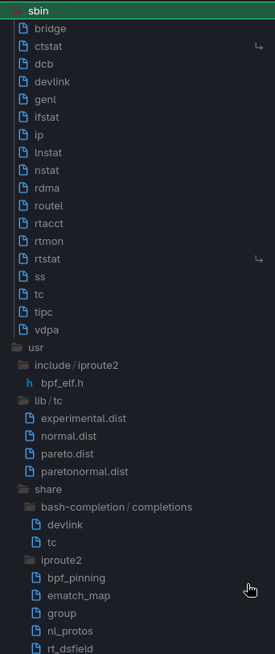

# Ralsei Package Format

## Storing of binaries
At the core each Ralsei package is a .tar.gz file where there are directories which contain files. The root is where these files are located the normal root is the system root so binaries should be put into "/usr/bin" inside thr tarball. This provides a simple installment system

Example of iproute2 tar.gz file output

## .ral package
The .ral package contains the binary .tar.gz file metioned before or an build script if its a package build from source  + package metadata, post install scripts and all that nice stuff. In reality a .ral package is just a .zip in disguise which contains a tarball for each architecture the package supports.

## .ralpkg format
mr azzy plz do eht